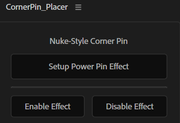
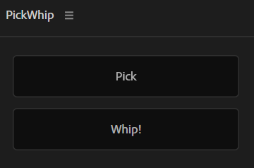
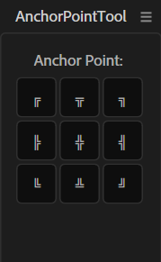

# After Effects Toolset

A collection of productivity scripts and tools for Adobe After Effects to streamline your workflow and automate common tasks.

## 📋 Table of Contents

- [Installation](#installation)
- [Scripts](#scripts)
  - [Camera Projection Tool](#camera-projection-tool)
  - [CornerPin Placer](#cornerpin-placer)
  - [PickWhip](#pickwhip)
  - [AnchorPointTool](#anchorpointtool)
  - [ClipSpeed](#clipspeed)
  - [Photos2Slides](#photos2slides)
  - [PreComposer](#precomposer)
  - [PromoteToEffect](#promotetoeffect)
  - [addKeysToShapes](#addkeystoshapes)
  - [convertToHold](#converttohold)
  - [linearMap](#linearmap)
  - [exErrors](#exerrors)
- [License](#license)

## 🚀 Installation

1. Download the desired script(s) from this repository
2. Place the `.jsx` files in one of the following locations:
   - **Windows**: `C:\Program Files\Adobe\Adobe After Effects [version]\Support Files\Scripts`
   - **Mac**: `Applications/Adobe After Effects [version]/Scripts`
3. For ScriptUI Panel scripts, place them in the `ScriptUI Panels` subfolder
4. Restart After Effects
5. Access scripts from: `File > Scripts > [Script Name]` or from the `Window` menu for panel scripts

## 📦 Scripts

### Camera Projection Tool

**Type:** ScriptUI Panel  
**Version:** 2.0

A comprehensive tool for creating clean plates from camera projections using a two-stage workflow.

**Features:**
- Setup camera projection effects with automatic configuration
- Copy effects between layers
- Two-stage workflow for clean plate generation
- Validates composition settings before execution

---

### CornerPin Placer

**Type:** ScriptUI Panel

Nuke-style corner pin setup using CC Power Pin effect, providing a familiar interface for After Effects users coming from Nuke.

**Features:**
- Setup CC Power Pin effect with Nuke-style workflow
- Enable/disable corner pins individually
- Intuitive panel interface
- Quick corner pin placement and adjustment

---

### PickWhip

**Type:** ScriptUI Panel

A property pick whip tool that allows you to easily link properties between layers accross compositions with a "Pick" and "Whip" workflow.

**Features:**
- Pick any property from any layer
- Create expression links between properties
- Silent pick operation with detailed whip alerts
- Simple two-button interface

---

### AnchorPointTool

**Type:** ScriptUI Panel

A utility for quickly moving and setting anchor points across layers and compositions, improving workflow when aligning and transforming layer pivots.

**Features:**
- Quickly set anchor point to layer centers, corners, or custom positions
- Apply anchor changes to multiple selected layers
- Align and lock anchor points for consistent transformations

---

### ClipSpeed

**Type:** Script

Control layer playback speed with adjustable parameters including speed percentage, offset, and frame rate.

**Features:**
- Adds Speed, Offset, and FPS sliders to selected layer
- Enables time remapping automatically
- Applies expression for dynamic speed control
- Perfect for slow motion or speed ramping effects

---

### Photos2Slides

**Type:** Script

Automatically arrange multiple selected layers horizontally with a multiplier slider control for easy slideshow creation.

**Features:**
- Parents multiple layers horizontally
- Adds a multiplier slider for smooth transitions
- Calculates layer widths automatically based on scaling
- Perfect for creating horizontal photo slideshows or carousels

---

### PreComposer

**Type:** Script

Batch precompose multiple selected layers individually, creating a separate precomp for each layer while maintaining layer names.

**Features:**
- Precomposes each selected layer individually
- Uses layer name as precomp name
- Moves all attributes to the new composition
- Processes layers from bottom to top

---

### PromoteToEffect

**Type:** Script

Promote layer properties to effect controls, making them easily accessible and animatable from the Effects panel.

**Features:**
- Converts properties to appropriate control types (Slider, Angle, Color)
- Maintains original property values
- Creates expression links automatically
- Organizes controls with descriptive names

---

### addKeysToShapes

**Type:** Script

Automatically adds keyframes to all shape paths and mask paths in selected layers at the current time.

**Features:**
- Recursively scans all property groups
- Finds Path and Mask Path properties
- Adds keyframes at current composition time
- Works with multiple selected layers

---

### convertToHold

**Type:** Script

Converts animated properties to hold keyframes, creating a stepped animation effect by baking values at each frame.

**Features:**
- Evaluates property values at every frame
- Creates keyframes with hold interpolation
- Works on multiple selected properties simultaneously
- Perfect for creating stop-motion style animations

---

### linearMap

**Type:** Script

Creates a linear mapping between a slider control and a selected property with custom min/max output values.

**Features:**
- Adds a "Mapping Slider" control to the layer
- Prompts for minimum and maximum output values
- Applies linear expression for value mapping
- Perfect for creating custom control ranges

---

### exErrors

**Type:** Script

Automatically finds and removes expression errors from selected layers, cleaning up problematic expressions.

**Features:**
- Scans all properties recursively
- Identifies properties with expression errors
- Removes expressions that have errors
- Reports how many errors were fixed

---

## 📄 License

See [LICENSE](LICENSE) file for details.

## 🤝 Contributing

Feel free to submit issues, fork the repository, and create pull requests for any improvements.

## 💡 Tips

- Always save your project before running scripts
- Most scripts work with selected layers or properties - make sure to select the appropriate items
- Panel scripts can be docked in your workspace for quick access
- Create keyboard shortcuts for frequently used scripts via `Edit > Keyboard Shortcuts`

---

*Collection of After Effects scripts for motion graphics and compositing workflows.*
